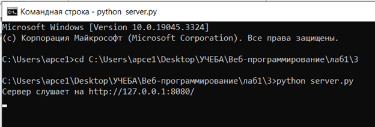

*Задание №3*


**server.py**
```python
import socket

# Создаем сокет для сервера
server_socket = socket.socket(socket.AF_INET, socket.SOCK_STREAM)

# Указываем IP-адрес и порт, на котором сервер будет слушать
host = "127.0.0.1"  # IP-адрес localhost
port = 8080  # Произвольный порт 

# Привязываем сокет к указанному адресу и порту
server_socket.bind((host, port))

# Начинаем прослушивать соединения
server_socket.listen(1)  # 1 - максимальное количество ожидающих соединений

print(f"Сервер слушает на http://{host}:{port}/")

while True:
    # Принимаем соединение
    client_socket, client_address = server_socket.accept()

    # Читаем запрос от клиента
    request = client_socket.recv(1024).decode()

    # Генерируем HTTP-ответ
    response = """HTTP/1.1 200 OK
Content-Type: text/html

"""

    # Открываем и читаем содержимое файла "index.html"
    with open("index.html", "r") as file:
        response += file.read()

    # Отправляем ответ клиенту
    client_socket.sendall(response.encode())

    # Закрываем соединение с клиентом
    client_socket.close()
```
	
**index.html**
```
<!DOCTYPE html>
<html>
<head>
    <title>MESSAGE LAB1</title>
</head>
<body>
    <h1>NIKIFOROV ARSEN</h1>
    <p>HTML-PAGE FROM MY SERVER</p>
</body>
</html>
```



Клиентский запрос через порт 8080

