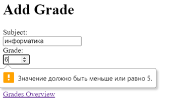
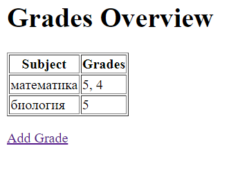

## Задание №5

---
**Задача:**
Необходимо написать простой web-сервер для обработки GET и POST http запросов средствами Python и библиотеки socket.

Базовый класс для простейшей реализации web-сервера доступен [здесь](https://docs.google.com/document/d/1lv_3D9VtMxz8tNkA6rA1xu9zaWEIBGXiLWBo1cse-0k/edit?usp=sharing).

Подробный мануал по работе доступен [по этой ссылке](https://iximiuz.com/ru/posts/writing-python-web-server-part-3/).

**Задачи сервера:**

- Принять и записать информацию о дисциплине и оценке по дисциплине.
- Отдать информацию обо всех оценах по дисциплине в виде HTML-страницы.

---
## Решение

**server.py**
```python
import http.server
import urllib.parse

grades = {}

class MyHttpRequestHandler(http.server.SimpleHTTPRequestHandler):
    def do_GET(self):
        if self.path == '/':
            self.send_response(200)
            self.send_header("Content-type", "text/html")
            self.end_headers()

            html = """
<!DOCTYPE html>
<html>
<head>
    <title>Add Grade</title>

</head>
<body>
    <h1>Add Grade</h1>
    <form method="POST" action="/add_grade">
        <label for="subject">Subject:</label><br>
        <input type="text" id="subject" name="subject"><br>
        <label for="grade">Grade:</label><br>
        <input type="number" id="grade" name="grade" min="1" max="5"><br><br>
        <input type="submit" value="Submit">
    </form>
    <p><a href="/grades">Grades Overview</a></p>
</body>
</html>

            """
            self.wfile.write(bytes(html, "utf8"))
            return
        elif self.path == '/grades':
            self.send_response(200)
            self.send_header("Content-type", "text/html")
            self.end_headers()

            # Формируем HTML-таблицу для обзора оценок
            html = """

            <html>
            <head>
            <title>Grades Overview</title>
            </head>

            <body>
            <h1>Grades Overview</h1>
            <table border="1">
            <tr><th>Subject</th>
            <th>Grades</th></tr>
            """
            for subject, subject_grades in grades.items():
                # Добавляем строки в таблицу для каждого предмета и его оценок
                html += f"<tr><td>{subject}</td><td>{', '.join(map(str, subject_grades))}</td></tr>"
            html += "</table><p><a href='/'>Add Grade</a></p></body></html>"
            self.wfile.write(bytes(html, "utf8"))
            return

    def do_POST(self):
        content_length = int(self.headers['Content-Length'])
        post_data = self.rfile.read(content_length).decode('utf-8')
        params = urllib.parse.parse_qs(post_data)
        subject = params['subject'][0]
        grade = params['grade'][0]

        try:
            grade = int(grade)
            if grade < 1 or grade > 5:
                raise ValueError("Grade out of range")
            if subject not in grades:
                grades[subject] = []
            grades[subject].append(grade)

            self.send_response(303)
            self.send_header('Location', '/')
            self.end_headers()
        except ValueError:
            self.send_response(400)
            self.end_headers()
            self.wfile.write(bytes("Bad request. Grade must be between 1 and 5.", "utf8"))

handler_object = MyHttpRequestHandler
my_server = http.server.HTTPServer(("localhost", 8080), handler_object)

print("Server is running on localhost:8080...")
my_server.serve_forever()
```
**Что делает код:**

- Создает HTTP-сервер, который обрабатывает GET и POST запросы.

**Обработчик GET запроса:**

- Отдает страницу для добавления оценок, если путь равен '/'.
- Отдает страницу с обзором оценок, если путь равен '/grades'.

**Обработчик POST запроса:**

- Принимает данные из формы (предмет и оценка).
- Проверяет и сохраняет оценку в переменную grades.
- Возвращает код состояния 303 (See Other) с перенаправлением на страницу для добавления оценок.


---
##Результат работы программы

**Страница для добавления оценок**

- Представляет собой HTML-форму, где пользователь вводит предмет и оценку.
- Отправляет данные методом POST на сервер по адресу "/add_grade" для обработки.



**Страница отображения оценок**

- Генерирует HTML-страницу с обзором оценок в виде таблицы.
- Использует данные из переменной grades (оценки по предметам) для отображения.
	

		
